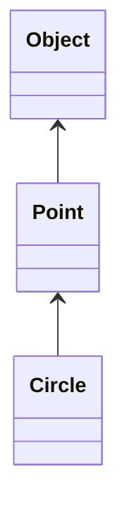

* Point "is-an" Object
* Circle "is-a" Point
* Circle "is an" Object
* Point is not a Circle

## Polymorphism 
* runtime ability for Java to take many Object types and change them to their correct types at runtime